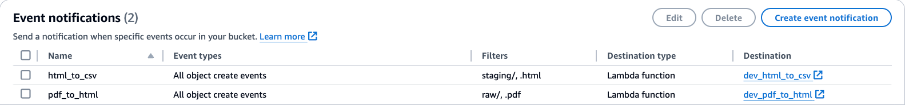

# CSV Extraction from PDF Files

This lambda demonstrates how to extract tabular data from PDF files.
This make use of Textract and Bedrock services in AWS.

## Pre-requisites

For lambda `pdf_to_html`, the `requirements.txt` file cannot be directly used to create the lambda layer. We need to download pre-built zip files to create 2 lambda layers.

1/ Create lambda layer for `poppler`.

- Download file `poppler.zip` from https://github.com/jeylabs/aws-lambda-poppler-layer/releases/download/2.0.0/poppler.zip

2/ Create lambda layer for `textract`.

- https://aws-samples.github.io/amazon-textract-textractor/using_in_lambda.html
- Download file `textractor-lambda-p311-pdf.zip` from https://github.com/aws-samples/amazon-textract-textractor/actions/runs/9663648259/artifacts/1636289937

After creating the lambda layers, update the lambda layers ARN for `lambda_pdf_to_html` module in `main.tf` file. Without setting the lambda layer ARN, you can manually configure the lambda function after its creation.

## Deployment

To use Terraform, update `backend.conf` to configure your own Terraform state backend.

```
tf init -backend-config=backend.conf -var-file=tfvars/dev.tfvars
```

```
tf plan -var-file=tfvars/dev.tfvars -lock=false
```

```
tf apply -var-file=tfvars/dev.tfvars -lock=false
```

```
tf destroy -var-file=tfvars/dev.tfvars -lock=false
```

## Post-Deployment Configurations

1/ In S3 bucket, add event notifications accordingly.


